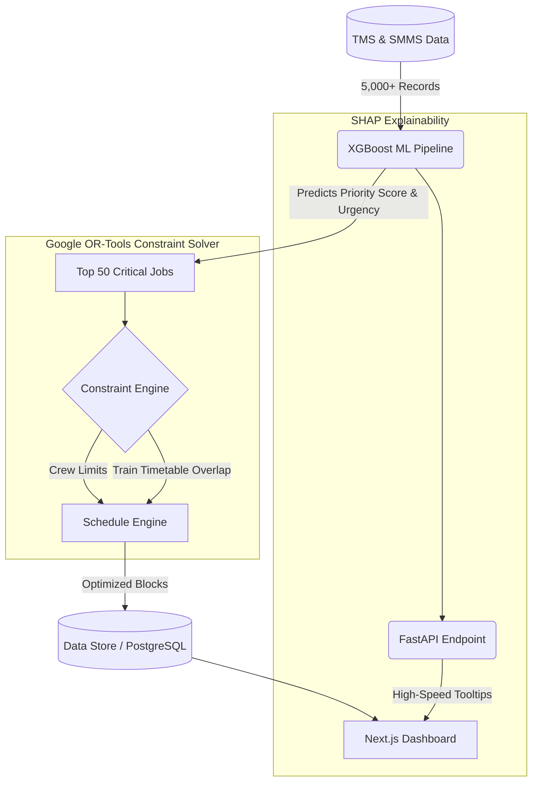

# 🚆 RailSync AI: AI-Driven Railway Maintenance Optimizer


**Smart India Hackathon 2026 | Team Helix | Problem Statement SIH26027**

A cutting-edge solution built for the **Smart India Hackathon (SIH)** to solve the complex problem of scheduling track maintenance without disrupting regular train operations.

RailSync AI runs on a **Hybrid AI Pipeline** — combining Machine Learning (XGBoost) for predictive prioritization and Operations Research (Google OR-Tools CP-SAT) for NP-Hard constraint optimization.

---

## 🎯 The Problem
Indian Railways faces massive challenges in scheduling maintenance blocks (P-Way, TRD, S&T) because the network is heavily congested. Manual scheduling leads to:
1. High train delay costs.
2. Under-utilization of maintenance resources.
3. Isolated departmental blocks (Civil vs. Electrical).

## 💡 Our Solution
RailSync AI is a **Digital Twin & Optimizer** that ingests unified data from TMS (Train Management System) and SMMS (Track Maintenance) to:
- **Fuse Blocks:** Automatically combine Civil and Electrical maintenance in the same corridor window.
- **Minimize Delay Penalty:** Prioritize jobs based on Gross Million Tonnes (GMT) and Speed Restrictions using an AI model.
- **Explainable AI (XAI):** Provide clear visibility into the AI's decision-making process with high-speed SHAP-value tooltips on the Gantt chart.
- **Multi-Horizon Planning:** Enable both weekly granular block execution (Gantt) and monthly strategic planning (aggregated tables).
- **Simulated External Data Ingestion:** Demonstrates production-readiness by routing synthesized track/maintenance data through robust API endpoints.

---

## 🧠 Architecture



---

## ✨ Key Features
- **Machine Learning Triage:** Uses XGBoost (95% accuracy) to filter thousands of backlog jobs based on complex interaction features like `GMT x Speed Restriction`.
- **Explainable AI (XAI) Microservice:** A dedicated FastAPI service instantly computes SHAP values (using XGBoost's native `pred_contribs`), rendering high-performance tooltips explaining *why* a specific job was prioritized.
- **Cross-Department Fusion:** Merges Civil (P-Way), Signaling (S&T), and Electrical (TRD) maintenance blocks to maximize track possession utility.
- **Multi-Horizon Visual Dashboard:** Interactive React-based dashboard featuring:
  - **Weekly Execution View:** A dynamic Gantt timeline with job shadowing and overlap visualization.
  - **Monthly Strategic View:** Aggregated KPI tables for high-level corridor planning.
  - **Department Filtering:** Real-time client-side toggles to isolate jobs by specific maintenance department.
- **API Data Ingestion Layer:** A robust Node.js to Python data routing pipeline mimicking real-world webhooks from external systems (TMS, SMMS, TDMS, COA).

---

## 💻 Tech Stack
- **Frontend:** Next.js, React, TailwindCSS
- **Backend API:** Node.js / Next.js API Routes
- **AI / ML Model:** Python, scikit-learn, XGBoost, Pandas
- **Constraint Solver:** Google OR-Tools (CP-SAT)
- **Database:** PostgreSQL (Prisma ORM)

---

## 🚀 How to Run Locally

### 1. Setup the Backend (Python Engine)
```bash
cd backend
python -m venv venv
venv\Scripts\activate   # (On Windows)
pip install pandas numpy xgboost scikit-learn ortools fastapi uvicorn
```

### 2. Run the AI Pipeline (Data Generation & Scheduling)
Generate the mock dataset and process it through the scheduler. You can generate data natively, or simulate a robust API webhook ingestion path using the `--via-api` flag:
```bash
# Standard generation
python generate_dataset.py

# OR: Generate and route through the Next.js API sync adapters
python generate_dataset.py --via-api

python train_model.py
python scheduler.py
python baseline_scheduler.py
python compare_results.py
```

### 3. Setup the Explainability Service (XAI)
Open a new terminal and start the FastAPI service on port 8001:
```bash
cd backend
python -m uvicorn explain_service:app --port 8001
```

### 4. Setup the Frontend (Next.js)
Open a new terminal and run:
```bash
cd frontend
npm install
npm run dev
```

### 5. View the Dashboard
Open your browser and navigate to: `http://localhost:3000`

---
*Built with ❤️ by Team Helix for Indian Railways at Smart India Hackathon 2026.*
